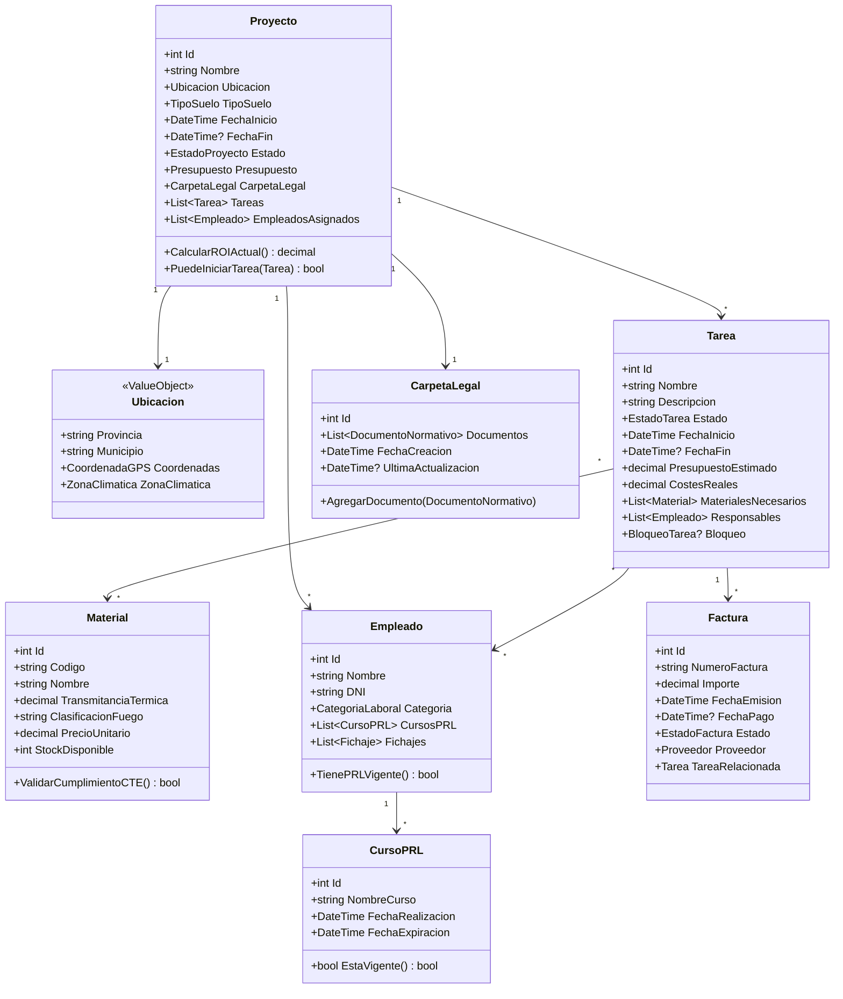

# Diagrama de Entidades del Dominio

## Enumeraciones Principales

### EstadoProyecto
- Planificacion
- EnCurso
- Bloqueado
- Finalizado
- Cancelado

### EstadoTarea
- Pendiente
- EnCurso
- Bloqueado
- Finalizado

### TipoSuelo
- Urbano
- Rustico

### CategoriaLaboral
- Peon
- OficialSegunda
- OficialPrimera
- Encargado
- JefeObra

---

**Versión**: 1.0  
**Autor**: Jorge Ros Gómez
